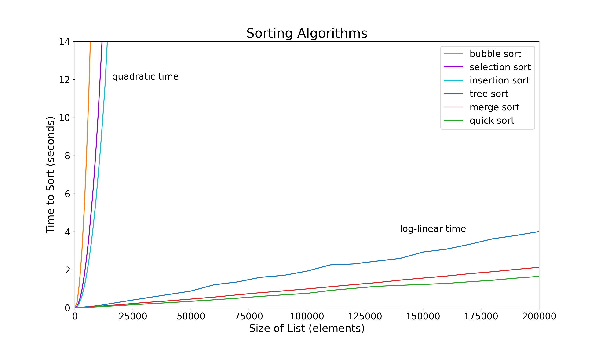
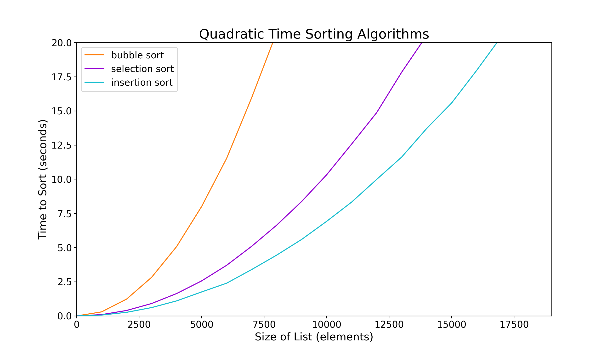
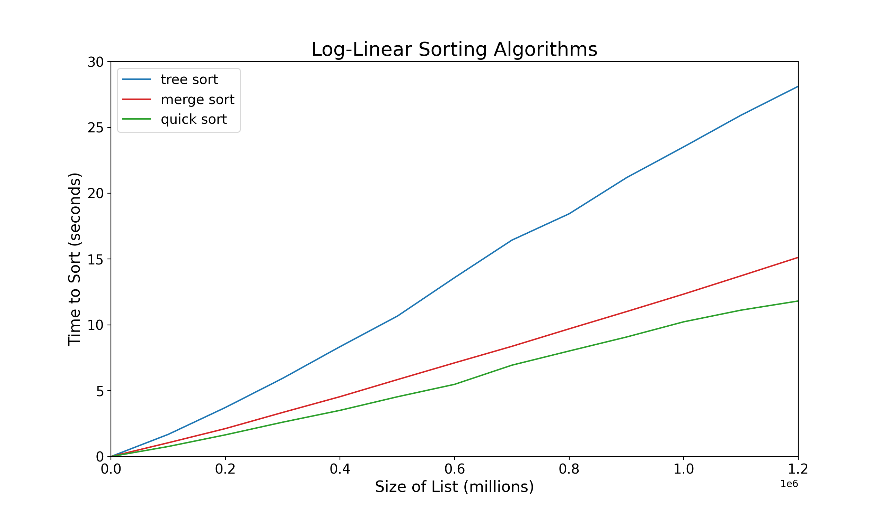

# Sorting Algorithms

### An Implementation and Analysis of 6 Comparison Sorting Algorithms

## Table of Contents
1. [Introduction](#introduction)
2. [Algorithms Time Analysis](#algorithms-time-analysis)
	* [Bubble Sort](#bubble-sort)
	* [Insertion Sort](#insertion-sort)
	* [Selection Sort](#selection-sort)
	* [Merge Sort](#merge-sort)
	* [Quick Sort](#quick-sort)
	* [Tree Sort](#tree-sort)
3. [Methodology](#methodology)
4. [Results](#results)
	* [All Algorithms](#all-algorithms)
	* [Quadratic Time Algorithms](#quadratic-time-algorithms)
	* [Log-Linear Time Algorithms](#log-linear-time-algorithms)
5. [Future Considerations](#future-considerations)
6. [Sorting Examples](#sorting-examples)
	* [Non-decreasing Order](#non-decreasing-order)
	* [People by Age](#people-by-age)

## Introduction

A sorting algorithm is an algorithm that can sort some data in order for some definition of order.
There are many ways to sort data but I chose 6 common algorithms to compare.
In all of my algorithms, the user must define the strict total order which means they must define how the data is ordered.
For example, ordering numbers by non-decreasing order, ordering words by lexicographic order, or ordering dog objects by their age attribute.
Examples of how to use the sorting algorithms can be found here: [Sorting Examples](#sorting-examples)

## Algorithms: Time Analysis

*Assume the strict total order predicate has a time complexity of `O(1)`.*<br>
*Let n be the size of the unsorted list*.

**Bubble Sort**

`O(n^2)` time complexity<br>
Goes through the list swapping adjacent elements which takes `O(n)` time in the worst case if it must swap at every element.
Goes through the list `n` times in the worst case. <br>
Therefore, the algorithm takes `O(n) * n === O(n^2)` time.

**Insertion Sort**

`O(n^2)` time complexity<br>
Inserts a random element into a sorted list that has a size of `n / 2` on average so it takes `O(n / 2)` time.
There are `n` inserts.<br>
Therefore, the algorithm takes `O(n / 2) * n === O(n^2)` time.

**Selection Sort**

`O(n^2)` time complexity<br>
Goes through the unsorted list to find the smallest element which has a size of `n / 2` on average and it is found half-way on average so it takes `O(n / 4)` time.
The smallest element is found `n` times and `n` swaps are performed.<br>
Therefore, the algorithm takes `O(n / 4) * n + n === O(n^2)` time.

**Merge Sort**

`O(nlog(n))` time complexity<br>
Merges all adjacent ordered lists which takes `O(n)` time.
There are `log(n)` merges.<br>
Therefore, the algorithm takes `O(n) * log(n) === O(nlog(n))` time.

**Quick Sort**

`O(nlog(n))` time complexity<br>
A pivot is picked and all smaller elements are put to the left and all larger elements are put to the right of the pivot.
There are `log(n)` steps on average.<br>
Therefore, the algorithm takes `O(n) * log(n) === O(nlog(n))` time.

**Tree Sort**

`O(nlog(n))` time complexity.<br>
An element is picked from the list and inserted into a binary search tree which takes `O(log(n))` time on average.
There are `n` inserts. Then in order depth first search is used to list the elements of the binary search tree in order which takes `O(n)` time on average.<br>
Thereforem the algorithm takes `O(log(n)) * n + n === O(nlog(n))` time.

## Methodology

First, each algorithm was implemented in Python.
I then created a program which would collect data on these algorithms.
The strict total order, `lambda x, y : x < y`, was used for all tests.
The perf_counter() function from the time module was used to record the length of time it took for an algorithm to run depending on the size of input.
Each algorithm was run 3 times on each size of input and the average was taken to improve accuracy.
The matplotlib package was used to plot and visualize the data.

## Results

Raw data can be viewed here: [Sorting ALgorithm Data](https://docs.google.com/spreadsheets/d/1_P_d599SQPivhfgRHGJy047k4BjXuFExgHi7NDWBXsI/edit?usp=sharing)


#### All Algorithms



#### Quadratic Time Algorithms



#### Log-Linear Time Algorithms




## Future Considerations

1. Compare the speeds of these algorithms with a randomly sorted list, already sorted list, and reverse sorted list.
2. Compare non-comparison sorts

## Sorting examples

#### Non-decreasing Order

Sorting natural numbers in non-decreasing order using tree sort.

```python
from tree_sort import tree_sort

lst = [1, 9, 8, 4, 6]
strict_total_order = lambda x, y : x < y  # this specifies non-decreasing order

sorted_lst = tree_sort(lst, strict_total_order)

print(sorted_lst)
# prints [1, 4, 6, 8, 9]
```

#### People by Age

Sorting people by their age then their name alphabetically if they have the same age using tree-sort.

```python
from tree_sort import tree_sort

class Person:
	def __init__(self, name, age):
		self.name = name
		self.age = age

person1 = Person("Laura", 18)
person2 = Person("James", 22)
person3 = Person("Sam", 12)
person4 = Person("Anthony", 18)

people = [person1, person2, person3, person4]

def strict_total_order(person1, person2):
	if person1.age != person2.age:
		return person1.age < person2.age
	elif person1.name.lower() != person2.name:
		return sorted([person1.name.lower(), person2.name.lower()])[0] == person1.name.lower()
	else: #names and age are equal
		return False

sorted_people = tree_sort(people, strict_total_order)

for person in sorted_people:
	print(person.name, end=" ")

# prints Sam Anthony Laura James

```